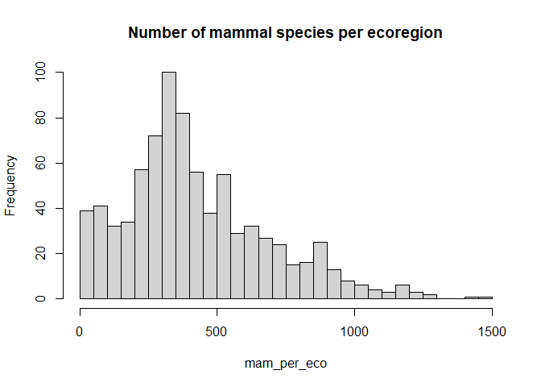

# Introduction

Dans cet exercice nous allons utiliser le package `dplyr` pour nous instruire sur la biogéographie des ours.

# Données

On utilise la base [**WWF Wildfinder**](https://www.worldwildlife.org/pages/wildfinder-database)

La base de données WildFinder du WWF contient des données de présence/absence pour les amphibiens, reptiles, oiseaux et mammifères terrestres du monde entier au niveau des écorégions terrestres. Seul le sous-ensemble des mammifères est disponible dans ce dépôt avec 4936 espèces. Les données, préalablement nettoyées, sont structurées de la manière suivante dans le dossier `data/wwf-wildfinder/` :

  - `wildfinder-mammals_list.csv` : liste taxonomique des 4936 espèces de mammifères du monde entier
  - `wildfinder-ecoregions_list.csv` : liste des 798 écorégions terrestres définies par le WWF
  - `wildfinder-ecoregions_species.csv` : correspondances entre les espèces et les écorégions

# Analyses

## Exploration des données

- Histogramme de la distribution du nombre d'espèces de mammifères par écorégion.


```r
#read wildfinder-ecoregions_species.csv
sp_eco <- datatoolboxexos::data_mammals_ecoregions()
```

```
## Parsed with column specification:
## cols(
##   ecoregion_id = col_character(),
##   species_id = col_double()
## )
```

```r
#tabulate the ecoregions
mam_per_eco <- table(sp_eco$ecoregion_id)

#histogram
hist(mam_per_eco,
     main = "Number of mammal species per ecoregion",
     breaks = 50
)
```

<!-- -->

### Importation des données 


```r
sp_eco <- datatoolboxexos::data_mammals_ecoregions()
```

```
## Parsed with column specification:
## cols(
##   ecoregion_id = col_character(),
##   species_id = col_double()
## )
```

```r
sp <- datatoolboxexos::data_mammals()
```

```
## Parsed with column specification:
## cols(
##   species_id = col_double(),
##   class = col_character(),
##   order = col_character(),
##   family = col_character(),
##   genus = col_character(),
##   species = col_character(),
##   common = col_character(),
##   sci_name = col_character()
## )
```

```r
eco_reg <- datatoolboxexos::data_ecoregion()
```

```
## Parsed with column specification:
## cols(
##   ecoregion_id = col_character(),
##   ecoregion = col_character(),
##   realm = col_character(),
##   biome = col_character()
## )
```

_Dans combien de royaumes, biomes et écorégions différents retrouve-t-on chacune des 7 espèces d'Ursidés ?_


```r
library(tidyverse)
```

```
## -- Attaching packages ----------------------------------------------------------------------------------------------------------- tidyverse 1.3.0 --
```

```
## v ggplot2 3.3.2     v purrr   0.3.4
## v tibble  3.0.3     v dplyr   1.0.1
## v tidyr   1.1.1     v stringr 1.4.0
## v readr   1.3.1     v forcats 0.5.0
```

```
## -- Conflicts -------------------------------------------------------------------------------------------------------------- tidyverse_conflicts() --
## x dplyr::filter() masks stats::filter()
## x dplyr::lag()    masks stats::lag()
```

```r
sp_ursus_list <-sp %>%
  filter(family == "Ursidae") %>% # selectionne les espèces d'ursidés
  filter(!str_detect(sci_name,'Ursus malayanus')) # remove Ursus malayanus
  
sp_ursus_sp_eco <- left_join(sp_ursus_list,sp_eco, by ="species_id" )  # jointure tables wildfinder-ursus_list et wildfinder-ecoregions_species

ursus_table <- left_join(sp_ursus_sp_eco, eco_reg, by = "ecoregion_id" ) #jointure  à wildfinder-ecoregions_list

ursus_table %>% 
  group_by(common, sci_name)%>%
  summarize(nb_realm =  n_distinct(realm),
            nb_biome = n_distinct(biome),
            nb_eco_reg = n_distinct(ecoregion_id)) %>%
  arrange(desc(nb_eco_reg))
```

```
## `summarise()` regrouping output by 'common' (override with `.groups` argument)
```

```
## # A tibble: 7 x 5
## # Groups:   common [7]
##   common              sci_name               nb_realm nb_biome nb_eco_reg
##   <chr>               <chr>                     <int>    <int>      <int>
## 1 Brown Bear          Ursus arctos                  3       11        139
## 2 American Black Bear Ursus americanus              3       10         82
## 3 Asiatic Black Bear  Ursus thibetanus              3       11         79
## 4 Sun Bear            Helarctos malayanus           2        5         39
## 5 Spectacled Bear     Tremarctos ornatus            1        3         23
## 6 Sloth Bear          Melursus ursinus              1        6         21
## 7 Giant Panda         Ailuropoda melanoleuca        1        4          6
```

_Correction_


